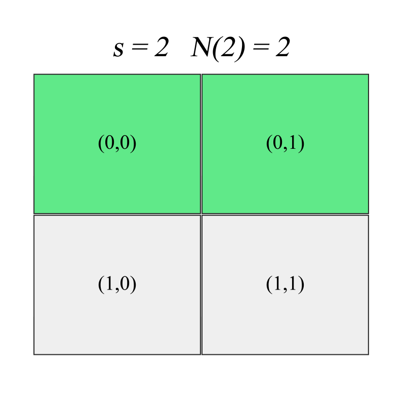
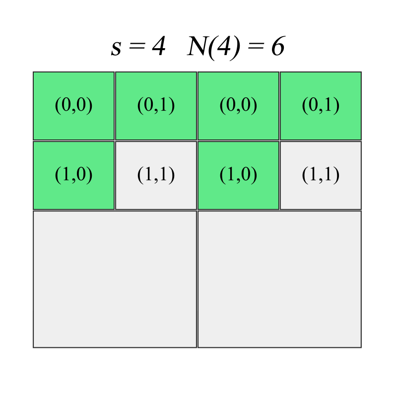
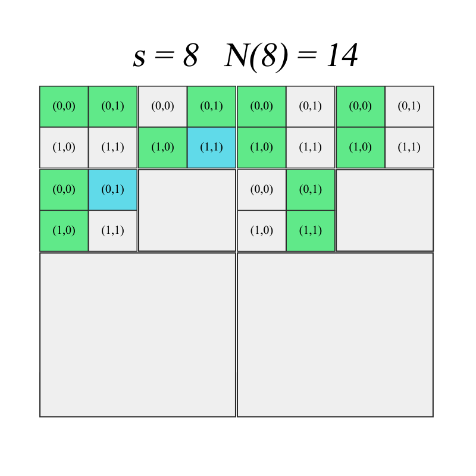

# Генерация фрактального изображения

## Описание алгоритма

Пусть на множестве имеется некоторый геометрический объект. Покроем объект минимальным количеством $N(\epsilon)$ шаров радиуса $\epsilon$. При достаточно малом радиусе шаров величина $N(\epsilon)$ будет меняться по степенному закону:

$\displaystyle{N(\epsilon)~\frac{1}{\epsilon^D}}$, где $D$ &mdash; фрактальная размерность. Формула представима в виде $\displaystyle{D=\lim_{\epsilon\to 0}{\frac{log(N)}{-log(\epsilon)}}}$

Пусть задано значение фрактальной размерности $D$ и набор сторон $E$={$\epsilon_1, \epsilon_2, \epsilon_3, ..., \epsilon_m$}. Для определенности, $\epsilon_i=\frac{1}{2^i}$, $i=1...m.$.

Введём замену переменных $s=\epsilon^{-1}$, которая будет обозначать количество квадратов (боксов) на сторону объекта. Построим дерево, где в каждом узле будут храниться локальные координаты выбранных элементов. Корнем дерева будет являться нулевая координата.

На каждом $i$-м шаге требуется поделить сторону бокса $i-1$ уровня на $2$, затем рандомно выбрать из получившихся элементов по $\displaystyle\lfloor\frac{N(D, \epsilon_i)}{N(D, \epsilon{i-1})}\rfloor$ дочерних узлов. Получившийся остаток от деления $\displaystyle mod\left({\frac{N(D, \epsilon_i)}{N(D, \epsilon{i-1})}}\right)$ равномерно распределим между дочерними узлами $i$-го уровня.

После того, как дерево построено, для построения изображения со стороной $s_i$ потребуется перевести локальные координаты в глобальные.

## Пример работы
Пример построения дерева (закрашенные квадраты &mdash; выбранные дочерние узлы, штриховка &mdash; остаток от деления):
<!--  -->
  

Генерация дерева глубиной 14:


## Как запустить

1. **Клонировать репозиторий:**

    ```bash
    git clone https://github.com/radifmin/FractalImageGenerator.git
    cd FractalImageGenerator
    ```

2. **Установка пакетов:**

    ```bash
    pip install -r requirements.txt
    ```

3. **Локальная установка в других проектах:**

    ```bash
    pip install -e .
    ```

## Использование
```bash
from fractal_image_generator import generate_fractal_image
import matplotlib.pyplot as plt

img = generate_fractal_image(D=1.3, depth=7)
plt.axis('off')
plt.show()
```